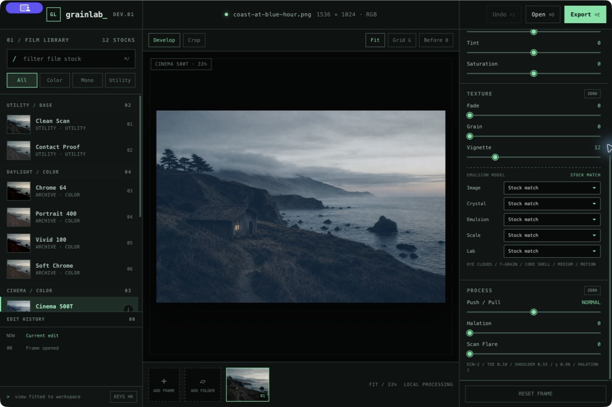

# Grainlab

Grainlab is a local, keyboard-first film development console for macOS. It combines a full-resolution photo workspace, a data-driven film library, and a physically informed WGSL processing pipeline inside a small Rust and Tauri application.

The visual language is deliberately closer to a darkroom terminal than a conventional consumer photo editor: dense but legible, fast to navigate, and designed to expose how an image is being formed rather than hide every decision behind a single preset button.



> Grainlab processes photographs locally. Images, edits, thumbnails, and exports are not uploaded to a service.

## Why Grainlab exists

Most “film” filters are a color cast, an S-curve, and tiled monochrome noise. Grainlab is a foundation for something more coherent: a stock describes scene sensitivity, emulsion response, image-forming material, lab process, grain structure, and scan/output behavior as related stages.

That distinction matters. A push process is not simply extra contrast. Bleach bypass is not ordinary desaturation. Color dye clouds do not look like metallic silver particles, and halation should originate in strong scene exposure before the output transform. Grainlab keeps those ideas separate enough to model, combine, inspect, and improve.

This is still an artistic emulator rather than a measured color-science product. Every stock dossier states its reference lineage, interpretation, caveats, and sources so that technical facts are not confused with creative decisions.

## Current capabilities

### Image workspace

- Opens JPG, PNG, and WEBP photographs through the picker, drag and drop, or paste.
- Opens a whole folder at once and adds every supported image to the filmstrip.
- Decodes and retains the full source resolution; the preview canvas is scaled visually without replacing the source with a proxy.
- Keeps independent stock selection, adjustments, crop, and edit history for every open frame.
- Supports free, original-ratio, and square crops with draggable handles and crop-aware export.
- Exports a 94-quality JPEG with a maximum 4096-pixel long edge.
- Ships with an offline 1536 × 1024 demonstration photograph so the app is immediately explorable.

### Navigation and inspection

- Scroll or trackpad gesture zooms around the pointer position.
- Double-click toggles a detail view.
- Drag pans a zoomed photograph; `Space` + drag provides an explicit pan gesture.
- Pan bounds include inspection overscroll so every image corner can reach the viewport.
- `B` temporarily shows the untouched source without changing the edit.
- A live luminance histogram and stock thumbnails are generated from the active frame.
- The top toolbar acts as a native macOS drag region while interactive labels and buttons remain usable.

### Film and process controls

- Tone: exposure, contrast, highlights, and shadows.
- Color: temperature, tint, and saturation.
- Texture: fade, grain, and vignette.
- Process: correlated push/pull development, halation, and scanner flare.
- Emulsion model: silver or dye image, cubic/T-Grain/Delta crystal geometry, uniform/mixed/core-shell emulsion, grain scale, and lab process.
- Lab processes: standard, push, pull, motion-picture ECN-2, retained-silver bleach bypass, and cross process.
- A live technical readout exposes the active family, toe, shoulder, gamma, and halation response.

### Personal scan-style learning

- Analyzes one positive film scan or a folder from one roll entirely on the local machine.
- Measures tone spacing, low-chroma color balance, density-dependent crossover, and tone-aware apparent grain structure.
- Produces an installable data-driven stock, raw evidence JSON, confidence labels, source previews, and a local HTML report.
- Keeps underdetermined properties such as exposure, halation, vignette, retained silver, and scanner flare neutral unless they are deliberately authored later.
- Treats the output honestly as a learned **scan style**—film, development, lab correction, scanner optics, sharpening, and scene content cannot be separated from unpaired finished photographs.

See [Learned film styles](docs/learned-film-styles.md) for the workflow, capture protocol, and inference limits.

## Film library

The bundled library combines a researched **Century 100** canon with ten Grainlab house/process profiles. The canon spans 45 monochrome and 55 color materials from the United States, Japan, the United Kingdom, Germany, Belgium, the Czech Republic, Italy, Austria, Ukraine/former USSR, and China. Its process coverage is 43 silver B&W, 25 C-41/chromogenic, 16 reversal, 14 ECN-2 cinema-negative, and two instant materials.

The word “top” is deliberately curatorial, not a fabricated worldwide sales ranking. Selection weighs historical and cultural use, technical influence, geographic and manufacturer breadth, process diversity, continued relevance, and the quality of surviving primary or authoritative documentation. The stable `century-100-v1` ranks make the selection reviewable and testable.

Every canon profile includes a neutral DSLR/iPhone starting posture, a stage-by-stage emulation recipe, curve and image-structure parameters, scan/lab guidance, known limits, and source citations. The ten unranked house profiles remain useful for Clean Scan, contact-proof, generic process, infrared, and creative starting points.

Every library entry includes a searchable technical dossier with:

- physical image formation and emulsion anatomy;
- sensitometry, exposure behavior, and processing guidance;
- palette, field uses, artistic marginalia, and known failure modes;
- reference stock, manufacturer, status, and interpretation disclaimer;
- primary-source technical references and a verification date.

Press `I` or click the information button beside a stock to open its dossier.

See [Century 100 research and methodology](docs/film-stock-century-canon.md) for the complete selection, coverage, input assumptions, and interpretation rules.

## Processing model

The GPU and CPU implementations follow the same stage order. The WebGPU path is the primary renderer and all shader work lives in WGSL.

```text
decoded sRGB source
        │
        ▼
1. SCENE / CAPTURE
   sRGB → linear light · exposure · white balance · channel sensitivity · flashing
        │
        ├── thresholded neighboring highlights → halation exposure
        ▼
2. EMULSION
   probabilistic crystal activation · silver/dye density structure · toe · shoulder
   development gamma · channel crossover · saturation compression
        │
        ▼
3. LAB / CHEMISTRY
   push or pull coupling · chemical fog · local density contrast · retained silver
        │
        ▼
4. SCAN / OUTPUT
   flare · resolution-scaled optical grain correlation · output tint · scan contrast
   creative tone/color controls · vignette · sRGB encoding · full-resolution output
```

### Scene and emulsion response

Input RGB is decoded to linear light before exposure and white-balance gains are applied. A stock can then weight the three source channels as either separate color records or a monochrome spectral approximation. The resulting exposure enters a normalized H-D-style response with independently controlled toe, shoulder, and development gamma.

Shadow and highlight crossover are separate three-channel vectors. That lets a stock create density-dependent color separation without baking one global cast into every luminance value. Saturation compression also responds to chroma magnitude instead of behaving as a fixed desaturation slider.

### Push, pull, and retained silver

The Push/Pull control couples several consequences that occur together in physical processing. A push lowers effective scene exposure while increasing development gamma, fog, local contrast, grain radius variance, and shadow-biased grain visibility. A pull does the inverse: additional exposure, softer gamma, a longer shoulder, and finer-looking grain.

Bleach bypass retains a neutral silver component over the color dye image. Grainlab models that as increased neutral density and contrast with reduced chroma, rather than treating it as a saturation preset.

### Halation and flare

Halation is sampled from thresholded neighboring highlights in the scene-linear image and added before the film response. Its radius is defined at a 2048-pixel reference edge and scales with the decoded photograph, so it does not change character simply because the source dimensions change.

Scanner flare remains a separate veiling-light control. It lifts the scan path rather than changing which emulsion crystals were exposed.

### Grain

Grain is part of the emulsion response, not a texture added after the image is encoded. Grainlab converts each scene-linear channel exposure into an approximate crystal-activation probability, then uses deterministic, spatially non-periodic fields to perturb that exposure before it enters the toe, straight-line, and shoulder response. A restrained signed density residual represents fog grains and developed structures that remain visible where multiplicative exposure variation would vanish. Both components continue through crossover, chemistry, scan contrast, creative adjustments, and sRGB encoding with the photograph underneath them.

The stochastic field does not use a repeating texture tile, which avoids the rosette and wallpaper artifacts common to simple film-grain shaders. Its correlated radii scale from a 1024-pixel reference edge so scans of the same simulated film area resolve the same clumps with more pixels instead of inventing finer physical grain.

Those stochastic populations are spatially anchored to the frame. Grain strength reveals more or less of the same developed structure, while apparent radius and push/pull development crossfade fixed fine, soft, and coarse populations. Controls never warp the noise coordinates or reseed the emulsion, so the grain cannot crawl across a stationary photograph while a slider moves.

The model combines multiple continuous stochastic fields and varies them by:

- metallic silver versus overlapping dye-cloud image formation;
- cubic, tabular, or Delta-style crystal geometry;
- uniform, mixed-size, or core-shell-inspired emulsion construction;
- mean clump radius and radius variance;
- local channel exposure, activation uncertainty, and additional shadow exposure bias;
- shared luminance grain versus weak independent dye-layer chroma variation;
- standard, pushed, pulled, motion-picture, bleach-bypass, or cross processing.

At fit view, grain should read as texture rather than an overlay. At 100%, coarse and pushed stocks reveal larger irregular clumps while fine tabular stocks remain restrained.

## Typical workflow

1. Open one photograph with `Cmd+O`, open a folder with `Shift+Cmd+O`, or drop images onto the canvas.
2. Search or browse the Film Library and select a stock.
3. Press `I` if you want to understand the stock’s physical model and field notes.
4. Adjust tone and color, then refine grain structure or lab process only when the photograph calls for it.
5. Scroll over the image to inspect full-resolution detail; hold `Space` while dragging to pan.
6. Switch to Crop for free, original, or square framing.
7. Use the history panel or `Cmd+Z` to revisit decisions.
8. Export the active developed frame with `Cmd+E`.

## Keyboard map

| Shortcut | Action |
|---|---|
| `Cmd+O` | Open one or more photographs |
| `Shift+Cmd+O` | Open every supported image in a folder |
| `Cmd+E` | Export the current frame |
| `Cmd+Z` | Undo the latest edit |
| `Cmd+K` | Toggle the command deck |
| `Cmd+/` | Focus Film Library search |
| `I` | Open the selected stock dossier |
| `B` | Hold to compare with the original source |
| `G` | Toggle the composition grid |
| `Up` / `Down` | Step through visible film stocks |
| Scroll over photo | Zoom around the pointer |
| Double-click photo | Toggle detail zoom |
| Drag zoomed photo | Pan directly |
| `Space` + drag | Pan explicitly |

## Run locally

### Requirements

- macOS 13 or newer;
- Xcode Command Line Tools;
- Rustup and Cargo;
- the pinned Rust 1.95.0 toolchain.

The setup script installs the pinned Tauri CLI and fetches Rust dependencies:

```bash
make setup
make doctor
make dev
```

`make dev` launches the Tauri application directly; there is no Node.js development server or frontend bundler.

### Development commands

| Command | Purpose |
|---|---|
| `make setup` | Install pinned tools and fetch dependencies |
| `make doctor` | Verify Cargo, Rust, Xcode tools, Tauri, and the lockfile |
| `make dev` | Launch Grainlab in Tauri development mode |
| `make check` | Check shell, JavaScript, Python, and Swift syntax, Rust formatting, Clippy, and tests |
| `make visual-test` | Verify licensed fixtures, run grain checks, and build the local visual report |
| `make learn-style INPUT=/path/to/roll ID=my-roll` | Analyze, report, install, and validate a personal scan style |
| `make icons` | Regenerate platform icons from the 1024px source asset |
| `make build-app` | Build, sign, verify, and copy the release app to `dist/` |
| `make clean` | Remove generated Cargo and app output |

## Build the macOS app

```bash
make check
make build-app
open dist/Grainlab.app
```

The build script produces a release `.app`, verifies bundle metadata and resources, checks the signature, applies an ad-hoc signature when needed for local use, and copies the result to `dist/Grainlab.app`.

Build metadata can be overridden without editing tracked configuration:

```bash
APP_NAME="Grainlab Beta" \
APP_BUNDLE_ID="com.example.grainlab-beta" \
APP_VERSION="0.2.0" \
./scripts/build_macos_app.sh
```

Set `UNIVERSAL=1` to build a universal Apple Silicon and Intel bundle. Set `FORCE_ICONS=1` to regenerate platform icons even when the source timestamp has not changed.

## Add or modify a film stock

Each stock is one JSON file beneath `ui/film-stocks/`. Category folders are organizational; the data inside the file controls rendering and library placement.

1. Copy the closest stock definition into the appropriate category folder.
2. Give it a unique `id`, library metadata, base creative settings, and physical `grainProfile`.
3. Define a version-1 `pipeline` covering scene sensitivity, curve, crossover, chemistry, optics, output, and grain detail.
4. Write its dossier with clear technical references, artistic intent, caveats, and primary-source URLs.
5. Run `make check` or `make dev`.

`src-tauri/build.rs` recursively discovers stock files, validates required fields, pipeline families, numeric ranges, vectors, palette colors, dossier sections, and HTTPS references, then regenerates `ui/film-stocks/index.json`. A valid new file appears in the app without editing JavaScript or HTML.

See [the film-stock schema guide](ui/film-stocks/README.md) for the complete interface and an annotated example.

## Project layout

```text
assets/
  icons/                         source icon and icon documentation
  screenshots/grainlab-app.jpg  README product screenshot
  symbols/                       exported SF Symbols

ui/
  index.html                     static application shell
  style.css                      terminal-inspired design system
  main.js                        state, controls, history, crop, zoom, and export
  gpu.js                         WebGPU device, buffers, uniforms, and dispatch
  grain.js                       deterministic CPU compatibility grain model
  shaders/photo.wgsl             full GPU development pipeline
  film-stocks/                   discoverable stock definitions and dossiers
  film-stocks/index.json         generated library manifest
  assets/demo-coast.png          bundled offline demonstration photograph

src-tauri/
  build.rs                       film-stock validation and manifest generation
  src/lib.rs                     Tauri application runner
  tauri.conf.json                window, security, and bundle configuration

scripts/
  setup.sh                       pinned tool setup
  doctor.sh                      environment diagnostics
  dev.sh                         development launcher
  check.sh                       repository validation
  run_visual_tests.sh            licensed fixture, metric, and report workflow
  learn_film_style.sh            local roll-analysis and stock-generation entry point
  learn_film_style.py            tone, color, and texture inference plus evidence report
  build_macos_app.sh             release packaging and verification

tests/visual/
  fixture-manifest.json          provenance, checksums, render matrix, and crop intent
  README.md                      visual calibration and baseline-refresh protocol
```

The frontend is intentionally static HTML, CSS, JavaScript, and WGSL. Rust owns the native Tauri shell and packaging boundary. This keeps the application inspectable and makes the film model easy to extend without introducing a JavaScript build toolchain.

## Validation and reliability

`make check` is expected to pass before packaging. It currently verifies:

- Bash syntax for repository scripts;
- JavaScript syntax for every frontend module plus Python and Swift syntax for repository tools;
- Rust formatting;
- Clippy with warnings treated as errors;
- Rust unit and documentation tests;
- all film-stock definitions through the Tauri build script.

At runtime, Grainlab requests a high-performance WebGPU adapter and compiles `photo.wgsl`. Shader compilation errors are surfaced before the pipeline is created. If WebGPU is unavailable or rendering fails, the app falls back to the CPU implementation and labels the active engine `CPU / SAFE` instead of silently changing behavior.

Renderer changes also use a local visual calibration suite. `make visual-test` downloads and verifies licensed Portra, Tri-X, and iPhone fixtures into the ignored `artifacts/` tree, generates controlled charts, runs the deterministic grain regression, measures available Grainlab renders, and produces `artifacts/visual-tests/report/index.html`. See [the visual test protocol](tests/visual/README.md) for the exact render matrix and interpretation limits.

## Privacy, scope, and current limitations

- Processing is local and the application does not include analytics or an upload path.
- JPG, PNG, and WEBP are supported; native RAW decoding is not implemented yet.
- Export currently targets JPEG and limits the long edge to 4096 pixels.
- The emulator uses physically informed parameter relationships but is not a spectral camera profile, measured scanner characterization, or ICC-managed print proof.
- Infrared appearance is inferred from visible RGB input; a three-channel visible photograph cannot recover wavelengths the camera never recorded.
- Stock names and dossiers identify references and interpretation status; Grainlab is not endorsed by the referenced film manufacturers.

## Build-on-top roadmap

- Native RAW decoding and camera-aware scene-linear input.
- Tiled GPU dispatch for extremely large panoramas and scans.
- Editable custom stocks, sidecar persistence, and preset sharing.
- Curves, straighten, masks, local corrections, and batch export.
- High-bit-depth intermediates and color-managed TIFF or PNG output.
- Scanner, enlarger, and paper profiles as explicit output modules.
- Expanded ColorChecker and camera-RAW calibration beyond the existing step-wedge and grain-spectrum fixtures.

## Template upstream

The reusable macOS and Tauri foundation is tracked as the `upstream` Git remote:

```bash
git fetch upstream
git log --oneline upstream/main
```

Grainlab and the template began with unrelated Git histories, so upstream improvements are reviewed and integrated selectively rather than merged wholesale over product-specific code.

## License

MIT
